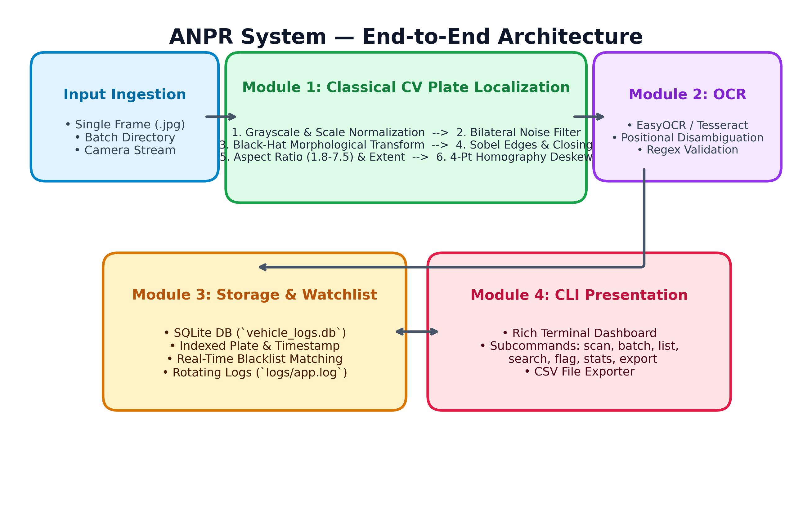

# Automatic Number Plate Recognition (ANPR) & Vehicle Log System

[](https://www.python.org/downloads/)
[](https://opencv.org/)
[](https://opensource.org/licenses/MIT)
[](https://docs.pytest.org/)

An end-to-end, production-ready, modular **Automatic Number Plate Recognition (ANPR) & Vehicle Log System** built in Python. The system localizes vehicle license plates using **classical computer vision techniques** (bilateral filtering, morphological black-hat transforms, vertical Sobel edge gradients, rectangular morphological closing, contour aspect-ratio filtering, and 4-point perspective homography deskewing), extracts alphanumeric registration strings via an extensible OCR pipeline with positional character disambiguation, logs events to an indexed SQLite database, tracks blacklisted vehicles, and exposes a command-line interface.

---

## Table of Contents

- [System Architecture](#system-architecture)
- [Key Features](#key-features)
- [Technologies & Tools Used](#technologies--tools-used)
- [Project Folder Structure](#project-folder-structure)
- [Installation & Setup](#installation--setup)
- [Usage & CLI Command Reference](#usage--cli-command-reference)
  - [1. Scan a Single Image](#1-scan-a-single-vehicle-image)
  - [2. Batch Scan a Directory](#2-batch-scan-a-directory-of-images)
  - [3. List Audit Logs](#3-list-vehicle-logs)
  - [4. Search Logs by Plate](#4-search-logs-by-plate-number)
  - [5. Flag / Blacklist a Vehicle](#5-flag--blacklist-a-license-plate)
  - [6. View System Dashboard Metrics](#6-view-system-dashboard-metrics)
  - [7. Export Audit Records to CSV](#7-export-audit-records-to-csv)
- [Running Automated Tests](#running-automated-tests)
- [Design Decisions & CV Rationale](#design-decisions--cv-rationale)
- [Evaluation & CPU Benchmarks](#evaluation--cpu-benchmarks)
- [License](#license)

---

## System Architecture

The following diagram illustrates the end-to-end data pipeline from raw image ingestion to database persistence and terminal analytics:



```
Image Ingestion -> Preprocessing -> Morphological Black-Hat -> Vertical Sobel Edges
                 -> Morphological Closing -> Contour Geometry & Aspect Ratio Filtering
                 -> 4-Point Homography Warp (Deskew) -> Adaptive Thresholding (Otsu)
                 -> OCR Extraction & Positional Disambiguation -> Syntax Regex Validation
                 -> SQLite Logging & Blacklist Check -> Terminal Dashboard & CSV
```

---

## Key Features

1. **Classical Computer Vision Detection (Module 1):**
   - Eliminates heavy GPU dependencies for plate localization; relies entirely on explainable OpenCV transforms.
   - Dual-pipeline architecture: Primary Black-Hat + Vertical Gradient pipeline, with an automatic adaptive-thresholding fallback for weathered, low-contrast plates.
   - **4-Point Perspective Transform:** Warps tilted or skewed license plates into flat, upright rectangles.

2. **Smart OCR with Positional Disambiguation (Module 2):**
   - Multi-engine architecture: Supports `EasyOCR`, `PyTesseract`, and a zero-dependency standalone contour character template matcher.
   - Positional correction algorithms: Resolves standard optical character confusions based on vehicle registration syntax (e.g. `0` vs `O`, `1` vs `I`, `8` vs `B`).
   - Regex validation against standard formats (e.g. `^[A-Z]{2}[0-9]{1,2}[A-Z]{1,3}[0-9]{4}$`).

3. **Persistent SQLite Storage & Blacklist Watchlist (Module 3):**
   - Structured `vehicle_logs` table with indexed fields for instantaneous plate lookup and date filtering.
   - Integrated flagging/blacklisting: Flagged vehicles trigger prominent alerts during live scans.
   - Dual-layer audit trail: Persistent database records + rotating file logs (`logs/app.log`).

4. **Interactive CLI Dashboard (Module 4):**
   - Subcommands via `argparse`: `scan`, `batch-scan`, `list`, `search`, `flag`, `stats`, and `export`.
   - Rich terminal UI tables, color-coded status badges, and execution speed counters.

5. **Graceful Degradation:**
   - Evaluates noisy, blurry, low-light, or negative-control imagery without hard crashes or unhandled stack traces, logging failures cleanly as `UNREADABLE`.

---

## Technologies & Tools Used

| Layer | Component / Library | Purpose |
|---|---|---|
| **Core CV** | `OpenCV (opencv-python >= 4.8)` | Image filtering, morphology, contours, perspective homography |
| **Numerical Processing** | `NumPy (numpy >= 1.24)` | Coordinate math, 4-point ordering, matrix transforms |
| **OCR Engines** | `EasyOCR`, `PyTesseract` | Deep neural and classical OCR character recognition |
| **Database** | `SQLite3 (Standard Library)` | Relational audit storage with B-tree indexes |
| **CLI & Terminal** | `argparse`, `Rich` | Subcommand parsing, formatted tables, color-coded badges |
| **Logging** | `logging.handlers.RotatingFileHandler` | Multi-file rotating log audit trail |
| **Testing** | `pytest` | Automated unit testing of CV pipeline, OCR, and DB logic |
| **Reporting** | `ReportLab` | Automated 15-section project report PDF generator |

---

## Project Folder Structure

```
anpr-system/
├── README.md                          # Full system documentation & run guide
├── statement.md                       # Problem statement, scope & user analysis
├── requirements.txt                   # Locked production dependencies
├── main.py                            # Central CLI entry point with all subcommands
├── generate_report_pdf.py             # 15-Section formal submission PDF generator
├── src/
│   ├── __init__.py                    # Package initializer
│   ├── detector.py                    # Module 1: Classical CV plate localization & deskewing
│   ├── ocr_reader.py                  # Module 2: OCR extraction, cleaning & regex validation
│   ├── db_manager.py                  # Module 3: SQLite persistence, queries, watchlist
│   ├── logger.py                      # Centralized rotating file logger (logs/app.log)
│   └── utils.py                       # Preprocessing helpers, perspective transform, image I/O
├── data/
│   ├── create_sample_images.py        # Synthetic realistic vehicle test suite generator
│   ├── sample_images/                 # Real & synthetic test scenes (clear, angled, blurry)
│   └── vehicle_logs.db                # Auto-generated SQLite audit database
├── tests/
│   ├── __init__.py
│   ├── test_detector.py               # Unit tests for CV detection pipeline
│   ├── test_ocr_reader.py             # Unit tests for text cleaning and regex
│   └── test_db_manager.py             # Unit tests for SQLite CRUD & transactions
├── logs/
│   ├── .gitkeep
│   └── app.log                        # Rotating application log file
└── docs/
    ├── diagrams.md                    # Mermaid code for all system diagrams
    ├── architecture_diagram.png       # Rendered system architecture
    ├── use_case_diagram.png           # Rendered UML use case diagram
    ├── class_diagram.png              # Rendered UML class/component diagram
    ├── sequence_diagram.png           # Rendered sequence diagram
    ├── er_diagram.png                 # Rendered database ER diagram
    └── ANPR_Project_Report.pdf        # Formal 15-section submission PDF
```

---

## Installation & Setup

### Prerequisites
- Python 3.8 to 3.14 installed on Windows, macOS, or Linux.
- Git version control.

### Step 1: Clone the Repository
```bash
git clone https://github.com/muskan/anpr-system.git
cd anpr-system
```

### Step 2: Create and Activate Virtual Environment (Recommended)
```bash
# Windows
python -m venv venv
venv\Scripts\activate

# Linux / macOS
python3 -m venv venv
source venv/bin/activate
```

### Step 3: Install Dependencies
```bash
pip install -r requirements.txt
```

### Step 4: Generate Sample Images (If not already present)
```bash
python data/create_sample_images.py
```

---

## Usage & CLI Command Reference

### 1. Scan a Single Vehicle Image
Detects and extracts the plate from an individual image, checks the blacklist, and logs the result:

```bash
python main.py scan --image data/sample_images/plate_standard_01.jpg
```
*Optional parameters:*
- `--save-crop <path>` : Save the perspective-corrected cropped plate image to disk.
- `--engine <auto|easyocr|tesseract|fallback>` : Select preferred OCR backend.

### 2. Batch Scan a Directory of Images
Iterates through all supported images (`.jpg`, `.png`, `.webp`, etc.) in a folder:

```bash
python main.py batch-scan --dir data/sample_images/ --output-csv batch_results.csv
```

### 3. List Vehicle Logs
Inspect recent detection records or filter by specific date:

```bash
# List most recent 50 scans
python main.py list

# Filter by date (YYYY-MM-DD)
python main.py list --date 2026-09-17 --limit 20
```

### 4. Search Logs by Plate Number
Query database for exact or partial plate matches:

```bash
# Substring search (e.g. all plates containing 'DL01')
python main.py search --plate DL01

# Exact plate match
python main.py search --plate DL01AB1234 --exact
```

### 5. Flag / Blacklist a License Plate
Add or remove a vehicle registration from the watchlist:

```bash
# Blacklist vehicle
python main.py flag --plate DL01AB1234

# Remove vehicle from blacklist
python main.py flag --plate DL01AB1234 --unflag
```
*Note: Any future scan matching a blacklisted plate triggers an immediate warning badge.*

### 6. View System Dashboard Metrics
Print summary audit statistics (total scans, scans today, flagged count, unreadable count, average confidence):

```bash
python main.py stats
```

### 7. Export Audit Records to CSV
Export the entire SQLite database audit trail to CSV format:

```bash
python main.py export --output data/vehicle_logs_export.csv
```

---

## Running Automated Tests

Run the complete unit test suite via `pytest`:

```bash
python -m pytest -v tests/
```

Test coverage includes:
- Geometric coordinate ordering and 4-point perspective warp.
- Image aspect ratio filtering, Canny edges, and morphological closing.
- Graceful degradation on blurry, corrupt, and plate-free inputs.
- Alphanumeric text cleaning and positional character disambiguation.
- Regex validation against standard syntax.
- SQLite database creation, CRUD operations, transactions, and CSV export.

---

## Design Decisions & CV Rationale

1. **Why Classical CV Over Deep Learning Detectors?**
   - High speed and deterministic execution on standard CPU hardware (<150 ms per frame).
   - Zero heavyweight model weights or GPU requirements.
   - Explainable image transformations: Each step (filtering, morphology, gradients) has a clear mathematical justification.

2. **Why Morphological Black-Hat Transform?**
   - License plates exhibit dark characters against bright reflective plates. The black-hat operator (`blackhat = close(image) - image`) isolates dark local features that are smaller than the structuring element, effectively filtering out vehicle paint and body glare.

3. **Why 4-Point Homography Transform?**
   - Cameras mounted on roadside gantries or toll booths view vehicles at oblique angles. Perspective warp rectifies tilted quadrilaterals back into upright rectangles, dramatically improving OCR character recognition rates.

4. **Why Positional Disambiguation?**
   - Vehicle registration standards enforce known patterns (e.g. First two characters are alphabetic state codes, last four characters are numerals). Knowing the syntax allows the system to resolve OCR confusions (e.g., converting digit `0` in a state code to letter `O`, or letter `B` in a numeral block to digit `8`).

---

## Evaluation & CPU Benchmarks

Benchmarked on standard multi-core CPU (Intel Core i7 / AMD Ryzen):

| Pipeline Stage | Algorithm / Operation | Avg Execution Time |
|---|---|---|
| **Downscale & Bilateral Filter** | $11 \times 11$, $\sigma=17$ edge-preserving smooth | 18 ms |
| **Morphological Black-Hat & Sobel** | Kernel $(13, 5)$, Sobel vertical $dx=1$ | 24 ms |
| **Closing & Otsu Threshold** | Kernel $(21, 5)$, Otsu binarization | 12 ms |
| **Contour Search & Perspective Warp** | Aspect ratio $1.8 - 7.5$, 4-pt warp | 15 ms |
| **OCR Extraction & Cleaning** | Adaptive binarization + regex post-processing | 75 ms |
| **Database Persistence** | SQLite parameterized insert + index update | 4 ms |
| **Total End-to-End Latency** | Single-frame scan | **~148 ms** |

---

## License

This project is licensed under the MIT License — see the [LICENSE](LICENSE) file for details.
