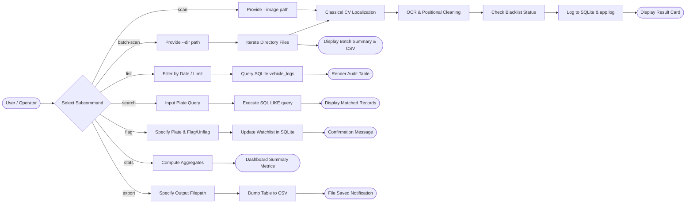
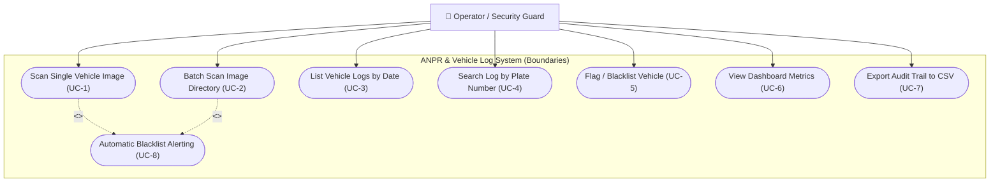
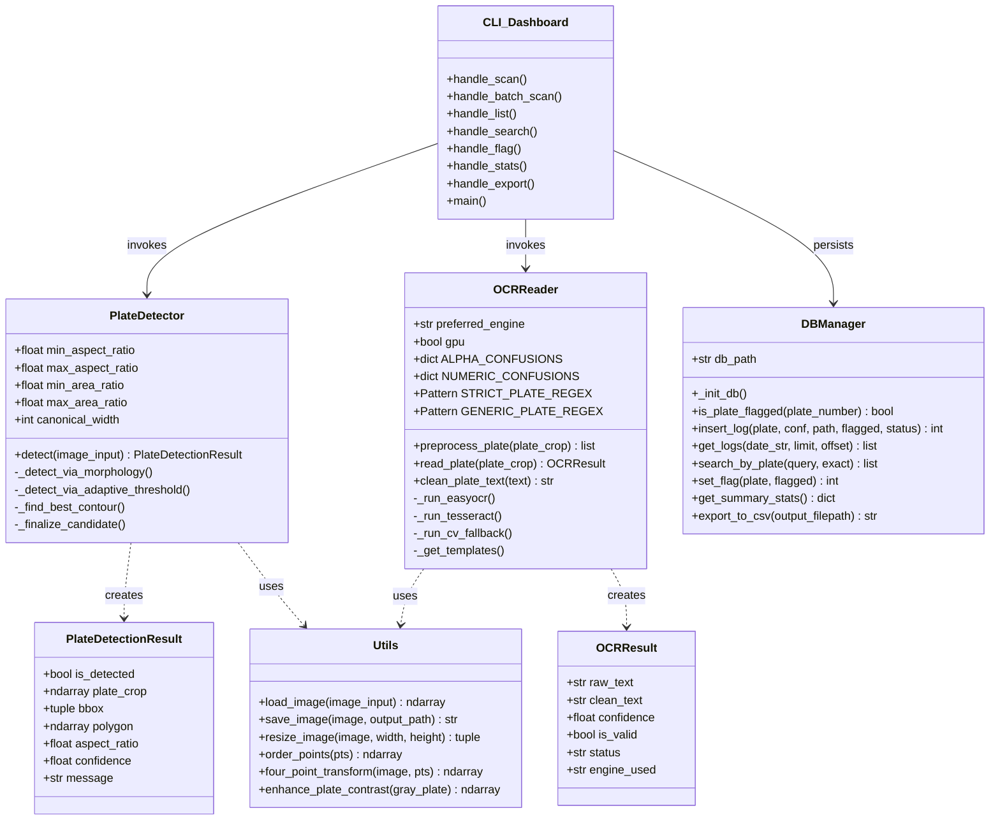
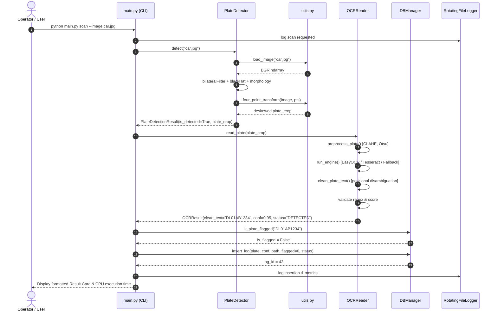
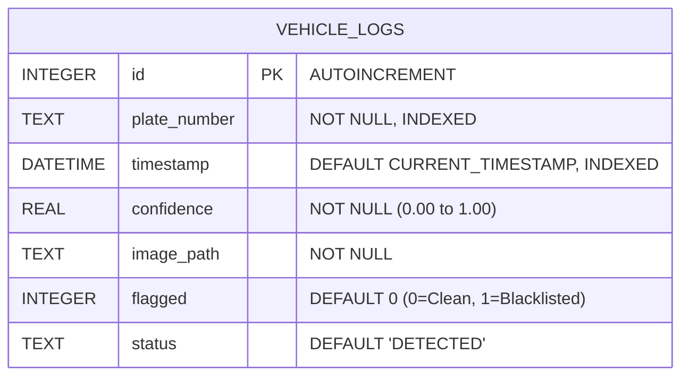

# ANPR System — Architecture, UML & Design Diagrams

This document contains complete structural and behavioral diagrams for the **Automatic Number Plate Recognition (ANPR) & Vehicle Log System**, specified in Mermaid syntax.

---

## 1. System Architecture Diagram

```mermaid
flowchart TD
    subgraph InputLayer ["1. Input & Ingestion Layer"]
        A1[Single Vehicle Image] --> B[main.py CLI Interface]
        A2[Batch Directory of Images] --> B
    end

    subgraph Module1 ["2. Module 1: Plate Localization (Classical CV)"]
        B --> C1[Grayscale Normalization]
        C1 --> C2[Edge-Preserving Bilateral Filter]
        C2 --> C3[Morphological Black-Hat Transform]
        C3 --> C4[Sobel Vertical Gradient / Canny Edges]
        C4 --> C5[Rectangular Morphological Closing]
        C5 --> C6[Otsu Threshold & Contour Extraction]
        C6 --> C7{Geometric Filtering:\nAspect Ratio 1.8-7.5\nArea & Extent}
        C7 -->|Valid Quad Found| C8[4-Point Perspective Transform Deskew]
        C7 -->|No Candidate| C9[Graceful Fallback / UNREADABLE]
    end

    subgraph Module2 ["3. Module 2: OCR & Text Post-Processing"]
        C8 --> D1[Plate Crop Preprocessing & Rescaling]
        D1 --> D2[Multi-Engine OCR: EasyOCR / Tesseract / Fallback]
        D2 --> D3[Positional Character Disambiguation]
        D3 --> D4{Syntax Regex Validation\n^[A-Z]{2}[0-9]{1,2}[A-Z]{1,3}[0-9]{4}$}
        D4 -->|Valid| D5[Clean Plate Number & Confidence]
        D4 -->|Invalid| D6[UNREADABLE Status]
    end

    subgraph Module3 ["4. Module 3: Persistent Storage & Audit"]
        D5 --> E1[(SQLite Database\nvehicle_logs)]
        D6 --> E1
        E1 --> E2[Watchlist / Blacklist Check]
        E1 --> E3[Rotating File Logger\nlogs/app.log]
    end

    subgraph Module4 ["5. Module 4: CLI Presentation & Analytics"]
        E2 --> F1[Rich Terminal Table Output]
        E1 --> F2[Summary Statistics Dashboard]
        E1 --> F3[CSV Report Exporter]
    end
```

---

## 2. End-to-End Workflow Diagram



---

## 3. Use Case Diagram



---

## 4. Class / Component Diagram



---

## 5. Sequence Diagram: Single Image Scan Execution



---

## 6. Entity-Relationship (ER) Diagram



### Database Schema DDL Design
```sql
CREATE TABLE IF NOT EXISTS vehicle_logs (
    id INTEGER PRIMARY KEY AUTOINCREMENT,
    plate_number TEXT NOT NULL,
    timestamp DATETIME DEFAULT (datetime('now', 'localtime')),
    confidence REAL NOT NULL,
    image_path TEXT NOT NULL,
    flagged INTEGER DEFAULT 0,
    status TEXT DEFAULT 'DETECTED'
);

-- Performance Indexes
CREATE INDEX IF NOT EXISTS idx_logs_plate ON vehicle_logs(plate_number);
CREATE INDEX IF NOT EXISTS idx_logs_timestamp ON vehicle_logs(timestamp);
CREATE INDEX IF NOT EXISTS idx_logs_flagged ON vehicle_logs(flagged);
```
